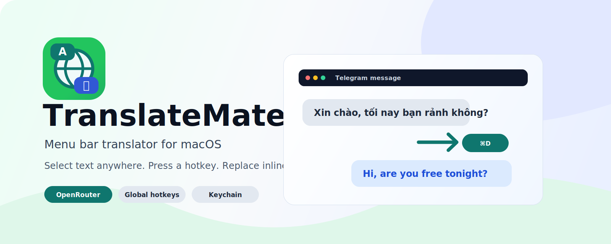

<div align="center">



# TranslateMate

**Dịch văn bản inline ở mọi app trên Mac, dùng AI từ OpenRouter (Gemini, Claude, GPT, DeepSeek, Llama…). Free.**

[](https://www.apple.com/macos/)
[](https://swift.org/)
[](LICENSE)
[](https://openrouter.ai)

</div>

---

## Vì sao có TranslateMate?

Mình hay chat tiếng Anh trên Telegram/Discord/Slack với người nước ngoài, nhưng não chỉ nghĩ được tiếng Việt cho mượt. Các app dịch tích hợp sẵn (Apple Translate trong Shortcut) thì cứng và quê. 

**TranslateMate** giải bài toán này:

- Bôi đen text → bấm hotkey → dịch ngay tại chỗ. Không phải copy/paste sang tab khác.
- Dùng OpenRouter — **truy cập 30+ free model** (Gemini, DeepSeek, Llama, Qwen…) với rate limit dư xài cá nhân.
- Hai chế độ: **Replace** (đè text khi compose) và **Popup** (hiện bản dịch khi đọc).
- Tự auto-swap ngôn ngữ — không phải nghĩ "lần này bấm hotkey nào".
- Mã nguồn mở. Dữ liệu local. Không telemetry.

## Tính năng chính

| | |
|---|---|
| ⌨️ **Global hotkey** | Carbon API, custom được. Chạy trên mọi app, không cần app target hỗ trợ. |
| 🔄 **Replace mode** (default ⌘⇧E) | Bôi đen → bấm hotkey → text bị đè bằng bản dịch. Dùng khi compose tin nhắn. |
| 💬 **Popup mode** (default ⌘⇧T) | Bôi đen → bấm hotkey → popup HUD bay ra với bản dịch. Dùng khi đọc tin. Esc để đóng. |
| 🔁 **Auto language swap** | Tự detect ngôn ngữ nguồn. Source = Vietnamese → output English, ngược lại cũng vậy. Không cần nghĩ. |
| 🆓 **Free models** | 30+ model miễn phí trên OpenRouter (Gemini 2.0 Flash, DeepSeek, Llama, Qwen…). Auto-fetch list từ OpenRouter API. |
| 🔁 **Auto-fallback chain** | Model 1 bị 429 → tự thử model 2/3/4. Không cần làm gì. |
| ⏱️ **Rate-limit tracker** | Mark model bị 429 vào cooldown, skip trong fallback chain cho đến khi quota reset. Persist qua launches. |
| 💰 **Cost tracking** | Track tokens + tính cost USD và VND theo từng request. Tổng tích luỹ trong History. |
| 📋 **Smart paste** | Đọc/ghi qua Accessibility API. Fallback clipboard + Cmd+V cho Telegram/Discord/Electron apps. Verify read-back để detect "AX nói dối". |
| 🔐 **API key trong Keychain** | Không lưu plaintext trong UserDefaults. |
| 🚀 **Launch at login** | Toggle 1 click qua `SMAppService` (macOS 13+). |
| 📜 **History** | 50 bản dịch gần nhất, kèm model + cost. Copy-paste lại được. |

## Yêu cầu

- macOS **13.0** trở lên (Ventura+)
- **Xcode** hoặc **Command Line Tools**: `xcode-select --install`
- **OpenRouter API key**: free, đăng ký 30 giây tại [openrouter.ai/keys](https://openrouter.ai/keys)

## Quick start

```bash
# 1. Clone
git clone https://github.com/duongtuanvn/TranslateMate.git
cd TranslateMate

# 2. (Khuyến nghị) Tạo self-signed cert một lần — giúp Accessibility grant
#    không bị reset mỗi khi rebuild
./build.sh setup-cert

# 3. Build và chạy
./build.sh run
```

Lần đầu chạy:

1. macOS hỏi quyền **Accessibility** → System Settings → Privacy & Security → Accessibility → bật cho TranslateMate.
2. App tự mở Settings → paste OpenRouter key vào ô **API key** → bấm **Validate key** xác nhận.
3. Tab **Translation** → click **Refresh** để fetch list model hiện có → chọn 1 free model.
4. Test: mở Notes, gõ "Xin chào bạn", `Cmd+A` bôi đen, `⌘⇧E` → text bị đè bằng "Hello, friend".

## Build commands

```bash
./build.sh                # Build .app vào ./build/
./build.sh run            # Build và mở app
./build.sh dmg            # Build và đóng gói thành DMG
./build.sh install        # Build và copy vào /Applications/
./build.sh setup-cert     # Tạo self-signed cert (1 lần) để giữ Accessibility grant
./build.sh reset-tcc      # Xoá TCC entry để re-grant Accessibility từ đầu
```

## Cấu hình

Mở Settings từ icon globe ở menu bar (hoặc `⌘,` khi menu đang mở).

### Tab General

- **Replace hotkey** + **Translate to**: tổ hợp phím + ngôn ngữ đích cho chế độ đè inline.
- **Popup hotkey** + **Translate to**: tổ hợp phím + ngôn ngữ đích cho chế độ popup.
- **OpenRouter API key**: paste key, có nút **Validate key** test endpoint `/auth/key`.
- **Compatibility → Always use clipboard paste**: bật nếu dùng Telegram/Discord/Slack/VS Code (mặc định ON).
- **System → Launch at login**: tự khởi động cùng macOS.

### Tab Translation

- **Model**: chọn từ list 30+ free hoặc 18 paid (cheap+popular). Hỗ trợ paste model ID custom.
- **Style**: Natural / Literal / Casual / Formal — ảnh hưởng tone bản dịch.
- **Custom instructions**: prompt thêm gửi kèm system prompt. Vd: *"Keep emoji and URLs as-is. Match Telegram chat tone."*
- **Fallback chain**: list model thử lần lượt khi primary bị 429/503.

### Tab History

- 50 bản dịch gần nhất với timestamp, model id, cost USD + VND, tokens count.
- Tổng cost tích luỹ ở header.
- Right-click để copy original / translation / model id.

### Tab Diagnostics

- Status cards: Accessibility, Hotkey, API key, Model, Target language.
- **Test API**: test OpenRouter key + model với text mẫu (không cần selection).
- **Re-register hotkey**: nếu hotkey bị conflict.
- **Rate-limited models**: list model đang trong cooldown + thời gian còn lại.
- **Log viewer**: 200 entry gần nhất, copy được để debug.

## Cách hoạt động

```
┌─────────────────┐
│ User bấm hotkey │
└────────┬────────┘
         ↓
┌──────────────────────────────────────────────┐
│  TextBridge: đọc selection                   │
│  ├─ AXUIElement (kAXSelectedTextAttribute)   │
│  └─ Fallback: Cmd+C giả lập + đọc clipboard  │
└────────┬─────────────────────────────────────┘
         ↓
┌──────────────────────────────────────────────┐
│  OpenRouterClient: gửi POST /chat/completions│
│  ├─ Primary model                            │
│  ├─ Fallback chain (auto-retry 429/503)      │
│  └─ Skip models đang cooldown                │
└────────┬─────────────────────────────────────┘
         ↓
┌──────────────────────────────────────────────┐
│  TextBridge: ghi text dịch                   │
│  ├─ AXUIElementSetAttributeValue             │
│  ├─ READ-BACK verify (Telegram/Electron lie) │
│  └─ Fallback: clipboard + Cmd+V giả lập      │
└────────┬─────────────────────────────────────┘
         ↓
   Track cost + history
```

### Tech stack

- **Swift 5.9** + **SwiftUI** + **AppKit** interop
- **Carbon HIToolbox** cho global hotkey (`RegisterEventHotKey`) — bền hơn `NSEvent.addGlobalMonitorForEvents`
- **ApplicationServices** cho Accessibility (`AXUIElementCreateSystemWide`, `AXUIElementSetAttributeValue`)
- **CoreGraphics** cho keyboard event simulation (`CGEvent`, `CGEventPost`)
- **ServiceManagement** (`SMAppService`) cho launch at login
- **Security** (`SecItem*`) cho Keychain storage
- **OpenSSL** trong build script để tạo self-signed cert

### File layout

```
TranslateMate/
├── README.md, LICENSE, PRIVACY.md, .gitignore
├── build.sh                           # Build script đa năng
├── assets/                            # icon.svg, banner.svg, AppIcon.icns
└── TranslateMate/
    ├── TranslateMateApp.swift         # @main entry
    ├── AppDelegate.swift              # Status bar + main flow wiring
    ├── HotkeyManager.swift            # Carbon global hotkey
    ├── HotkeyShortcut.swift           # Shortcut data type
    ├── HotkeyRecorderView.swift       # UI ghi hotkey từ user
    ├── TextBridge.swift               # AX read/write + clipboard fallback
    ├── OpenRouterClient.swift         # API client + fallback chain + cost calc
    ├── RateLimitTracker.swift         # Cooldown tracker, persistent
    ├── SettingsStore.swift            # ObservableObject + UserDefaults + Keychain
    ├── SettingsView.swift             # SwiftUI Settings (4 tabs)
    ├── TranslationPopup.swift         # HUD popup window
    ├── Logger.swift                   # os.Logger + buffer cho Diagnostics
    ├── Keychain.swift                 # SecItem helpers
    ├── Info.plist
    └── TranslateMate.entitlements
```

## Troubleshooting

### Hotkey không fire

- **Conflict với app khác**: `⌘D` bị Telegram/Safari/Finder chiếm. Đổi sang `⌘⌥E` / `⌘⌥T` / `⌃⌥⌘Space`.
- **Test sai chỗ**: Đảm bảo bạn đang ở app NGOÀI TranslateMate (vd Notes) và đã bôi đen text trước khi bấm.
- Mở Diagnostics tab → log → nếu không thấy `Hotkey triggered: ...` → hotkey đó bị chiếm, đổi tổ hợp.

### Accessibility "đã bật" mà app vẫn báo "NOT granted"

Đây là **TCC cdhash cache** issue khi ad-hoc sign:

```bash
./build.sh reset-tcc
./build.sh run
```

Hoặc tốt hơn, dùng self-signed cert (1 lần setup):

```bash
./build.sh setup-cert
./build.sh run    # cdhash giờ ổn định, grant không bị invalidate khi rebuild
```

### Telegram nói dịch xong nhưng text không đổi

Telegram là Electron-ish app, không apply `kAXSelectedTextAttribute` nhưng vẫn return success → app verify-read-back và fallback clipboard. Bật **Settings → General → Compatibility → Always use clipboard paste** (mặc định ON).

### "All free models exhausted" alert

Tất cả free model trong fallback chain đều 429. Lựa chọn:

1. **Đợi vài phút** — quota free reset thường xuyên
2. **Thêm model vào fallback chain** trong Settings → Translation
3. **Switch sang paid model rẻ** — chỉ vài đồng/câu, có quota riêng

### Lỗi "App is damaged and can't be opened" (App bị hỏng)

Khi tải bản build `.dmg` hoặc `.zip` từ internet, macOS sẽ tự động gắn cờ "quarantine" (cách ly) bảo mật. Vì app dùng ad-hoc signing thay vì chứng chỉ Apple Developer trả phí, macOS Gatekeeper sẽ chặn và báo lỗi "damaged" (hỏng).

**Cách fix (gỡ cờ quarantine):**
1. Đảm bảo bạn đã kéo app vào thư mục Applications.
2. Mở ứng dụng **Terminal**.
3. Chạy lệnh sau:
   ```bash
   sudo xattr -cr /Applications/TranslateMate.app
   ```
4. Điền mật khẩu máy Mac của bạn nếu được hỏi.
5. Mở lại app bình thường.


## Privacy

Đọc [PRIVACY.md](PRIVACY.md) — bản tóm tắt:

- **Chỉ text bạn bôi đen** được gửi qua HTTPS đến OpenRouter
- API key lưu trong **macOS Keychain** (encrypted)
- Lịch sử dịch lưu local trong UserDefaults, không sync cloud
- **Không có telemetry**, không có analytics, không có tracking

## Tuỳ chỉnh

Hầu hết user clone về có thể đổi:

```bash
# build.sh dòng 17
BUNDLE_ID="com.tuanduong.translatemate"
```

Đây là giá trị duy nhất phải đổi để app sạch đối với máy bạn. Logger / Keychain / TCC tự lấy bundle ID từ Info.plist.

Các default khác (hotkey, model, fallback chain) chỉnh trong UI Settings, không cần sửa code.


## License

[MIT](LICENSE) © 2026

## Tác giả & cảm ơn

- **Author**: Tuan Duong — [tuan.digital](https://tuan.digital) | [@duongtuanvn](https://github.com/duongtuanvn)
- Một sản phẩm của **vibecode**

---

<div align="center">

**Nếu app giúp bạn dịch nhanh hơn, hãy ⭐ star repo và share với bạn bè cũng chat đa ngôn ngữ.**

</div>
